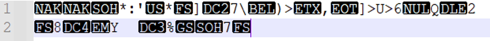

# codeboobsters__ctf
**This page is intended for ctf task developers**

---
## Guessing game

**Описание:** Я зашифровал текст, а ты теперь угадай как.


**Решение:**
Тест мал, а значит методы статистики не работают и придётся использовать методы анализа используя часть открытого текста ***tqlCTF{***

В файле содержаться случайные байты, а не конкретные символы, что свидетельствует о том, что перед нами шифр, работающий на байтах.

К таким относится **Кузнечик, AES, XOR и множество других шифров**.

Но так как нас попросили угадать, то это скорее всего какой-то простой шифр.

Предположим, что это **XOR**, тогда можно найти часть ключа зная начало открытого текста следующим образом: **k=m⊕c**, где **k – ключ**, **m – исходное сообщение**, **c – зашифрованное сообщение**.

**Тогда получаем:** ***Key = “adminad”***

Как видим, получилось осмысленное слово **admin**, а после оно повторяется, тогда убеждаемся, что перед нами **XOR** и **ключ** ***admin***. Применяем его и находим флаг.

**Получаем:** ***tqlCTF{Gu3sS1nG_gAm3_1S_n0t_crYpt0grAphY}***

Для решения можно составить следующий код на языке **Python:**

```python

FLAG = b'tqlCTF{'

def XOR(text, key):
    ct = bytes([text[i] ^ key[i % len(key)] for i in range(len(text))])
    return ct

def main():
    with open('ciphertext', 'rb') as file:
        ct = file.read()
    key = XOR(ct[: len(FLAG)], FLAG)
    print(key)
    KEY = input("Введите ключ: ").encode()
    flag = XOR(ct, KEY)
    print(flag)

if __name__ == "__main__":
    main()
```

---

## Warm-up

**Описание:** Это зашифрованная картинка. Иди расшифруй её.


**Решение:**
Ещё одно лёгкое задание, для которого можно не знать криптографию. Также оцениваем файл. Отличие от предыдущего заключается в том, что файл большой, а значит и можно применить методы статистики. Плюс ко всему мы знаем, что это файл **.jpg**, а значит, как и в предыдущем примере можем оперировать знанием начала.
Для анализа используем **CrypTool**. Бесплатный инструмент для анализа простейших шифров и запускаем анализ. Можно вначале просто проанализировать статистику энтропию и т. д. А можно сразу пойти по анализу простейших шифров. 
Запускаем анализ **XOR:**


**Критерий согласия выдаёт следующее:**


Судя по явным всплескам это действительно XOR и длина ключа 19. 

**Теперь подбираем ключ:**


**И расшифровываем:**


Судя по началу файла это действительно **.jpg**. Значим файл расшифрован. Сохраняем его и открываем:


Видим, как какой-то хрен говорит флаг и переписываем его.

**Ответ:** ***tqlCTF{crypt_cures_cancer}***

---

## Permutation

**Описание:**
Он использует шифр перестановки для шифрования флага. Перед этим он запихивает флаг в картинку. Попробуйте разгадать шифр, нам известен только его ВК: https://vk.com/by.serg1997

**Решение:**

Мы имеем зашифрованную картинку методом перестановки.
Видно, очертания картинки и можно понять, что имеем дело с вертикальной перестановкой, причём длина небольшая, иначе невозможно было бы разобрать текст. Можно уже начать расшифровывать, используя статистику, но наличие оригинала помогло бы в сборе статистики. Для этого переход в ВК.
На стене находим оригинал фотографии:

Так же можно обратить внимание на комментарии и найти исходник фотографии уже в формате BMP и также алгоритм шифрования:


Теперь у нас есть оригинал картинки без флага и алгоритм шифрования, в котором убеждаемся, что это вертикальная перестановка и длина ключа 40.
Воспользовавшись тем, что перед нами оригинал соберём биграммы пикселей между соседними столбцами.

**Теперь для восстановления ключа можно поступить следующим образом:**
1.	Предположим, что после столбца i стоит столбец j
2.	Собираем биграммы их пикселей
3.	Находим отличие от биграмма оригинала для каждого столбца 
4.	Если отличие велики, то предполагаем другой столбец j и т. д. В общем случае пробежаться по всем вариантам j и найти наименьшее отклонение это и будет настоящее место столбцов

**Реализовав такой алгоритм, получим следующую картинку:**

Опять этот мужик говорит флаг.
Можно реализовать следующий код на языке **Python:**
```python
from collections import Counter

def Deviation(stat1, stat2):
    return sum([abs(stat1[k] - stat2[k]) if k in stat2.keys() else stat1[k] for k in stat1.keys()])

def main():
    L = 20
    with open('original.bmp', 'rb') as file:
        text = file.read()
    n = int.from_bytes(text[10:14], byteorder = "little")

    text_pixel = [text[i: i+3] for i in range(n, len(text), 3)]
    len_pixel = len(text_pixel)

    text_table = [[text_pixel[i + j] for j in range(0, len_pixel, L)] for i in range(L)]
    text_table_stat = [dict(Counter([text_table[i][j] + text_table[i+1][j] for j in range(len(text_table[0]))])) for i in range(L - 1)]

    with open('cipher.bmp', 'rb') as file:
        text = file.read()
    n = int.from_bytes(text[10:14], byteorder = "little")

    text_pixel = [text[i: i+3] for i in range(n, len(text), 3)]
    len_pixel = len(text_pixel)
    text_table = [[text_pixel[i + j] for j in range(0, len_pixel, L)] for i in range(L)]

    print(sum(text_table_stat[1].values()))
    key = [-1] * L
    for i in range(L):
        print(i)
        min_stat = sum(text_table_stat[0].values())
        mi, mj = 0, 0
        for j in range(L):
            if i == j:
                continue
            stat = dict(Counter([text_table[i][k] + text_table[j][k] for k in range(len(text_table[0]))]))
            for k in range(L-1):
                D = Deviation(stat, text_table_stat[k])
                if D < min_stat:
                    min_stat, mk, mi, mj = D, k, i, j
        print(min_stat, mk, mi, mj)
        key[mk] = mi
        key[mk+1] = mj
            
    cipher = text[:n]
    cipher_table = [text_table[k] for k in key]
    c = b''.join([b''.join([cipher_table[i][j] for i in range(L)]) for j in range(len(text_table[0]))])
    cipher += c
    with open('flag.bmp', 'wb') as file:
        file.write(cipher)

if __name__ == "__main__":
    main()
```

**Ответ:** ***tqlCTF{https_vk_com_prim_pds}***

---

## Roots

**Описание:**
Я придумал новую цифровую подпись надеюсь никто не умеет брать корень третьей степени.

``sig = 20006730618717375606839513453517611545580682948201876053448260500986437102770975364968061656506332351765997333137066634435100239281599204453712047279460928310094936958937405812929965800225401005360782769067807325858353598053868582402509840297690216457315172977273090540986047708104581696718828431196335356302557617330862275200242090862227926879505825958711975387201837030154941339474233440197818617887635581136788144229803391860984329944202923008948424405647417771356980492527896708963344258192569589140554564035234704501171669229829740277045368089073816020602222694009072142432761321644472141438623894456360634164501
p = 27754121775618975505842693271747180802220591278275870653604147825536810576145921584823251503808118663743728477947528751912486589734951931460950226378827070621651069041518009705738341590493540793327128393482345913448171750522471876372452298147243206373604484469792247279667554999208540083455822123817652467948818490412757814030509132757813397320968977465947594860186619899700784766140418198467324876266148167436996571620663833451062168340773242908451700419904803386174091017976854327623721766866584582821658735871995178008687677597083490377270770040331019912012566400408762668968745769277665039091724562160083010036177``

```python
from Cryptodome.Util.number import getPrime, bytes_to_long
from math import gcd
from os import urandom

FLAG = b'tqlCTF{???????????????????????????????????}'

def main():
    d = 3
    while True:
        p = getPrime(2048)
        if gcd(p-1, d) != 1:
            break
    flag = FLAG + urandom(64)
    print(f'sig = {pow(bytes_to_long(flag), d, p)}')
    print(f'p = {p}')

if __name__ == "__main__":
    main()

```


**Решение:**

Корни третьей степени действительно брать трудно, учитывая, что про это никто не пишет. Однако это не проблема. Для понимания как это вообще возможно просто вспомните **RSA:**
**Шифрование:** c= m^e (mod n)
**Расшифрование:** m= c^d (mod n)

То есть фактически это и есть нахождение корня **e-ой** степени для этого надо возвести число в степень **d**, которое находится как: **d=e^(-1) (mod φ(n))**. Так как у нас число простое, то **φ(p)=p-1**. 
Значит мы сможем найти **3^(-1) (mod p-1)**. Но теперь другая проблема **НОД(3,p-1)≠1**. 

**Значит число 3 не имеет обратного по модулю p-1**. 
Но фактически это означает, что степень числа **m^3 (mod p)** имеет степень **(p-1)/3**. Значит и обратное к 3 надо искать по нему. Находим **e =3^(-1) (mod (p-1)/3)**. 
Теперь чтобы найти исходный корень нужно просто возвести зашифрованный текст в степень **e: m=c^e (mod p)**.
Проделав это, мы всё равно не получим флаг. 
Но в чём же дело, если проверить, то **m^3=с (mod p)**. 
Значит мы действительно нашли кубический корень из числа c. 
Проблема заключена в том, что мы нашли один кубический корень, а их в общем случае может быть 1 или 3. То есть мы имеем ещё два корня среди которых находится наш флаг. 
**Как же их найти? **
Для этого вспомним как находятся кубические корни для действительных чисел:


То есть для нахождения всех кубических корней необходимо найти хотя бы один, а после умножить его на **((-1±√3 i))/2**. 
В нашем случае по модулю никакой разницы нет, так как квадратный корень спокойно находится методом Тонелли-Шенкса. 
Мнимая единица — это корень минус единицы, что опять же реализуемо по модулю. И деление на 2 это умножение на обратный. 
Тогда по модулю можно записать следующее:


Так как один корень мы уже нашли, то остальные не осталось проблем. 

**Среди корней и будет флаг:** ***tqlCTF{can_you_take_roots_of_the_third_degree}***

Данный алгоритм можно реализовать следующим кодом на языке **Python:**

```python
from Cryptodome.Util.number import long_to_bytes

sig = 20006730618717375606839513453517611545580682948201876053448260500986437102770975364968061656506332351765997333137066634435100239281599204453712047279460928310094936958937405812929965800225401005360782769067807325858353598053868582402509840297690216457315172977273090540986047708104581696718828431196335356302557617330862275200242090862227926879505825958711975387201837030154941339474233440197818617887635581136788144229803391860984329944202923008948424405647417771356980492527896708963344258192569589140554564035234704501171669229829740277045368089073816020602222694009072142432761321644472141438623894456360634164501
p = 27754121775618975505842693271747180802220591278275870653604147825536810576145921584823251503808118663743728477947528751912486589734951931460950226378827070621651069041518009705738341590493540793327128393482345913448171750522471876372452298147243206373604484469792247279667554999208540083455822123817652467948818490412757814030509132757813397320968977465947594860186619899700784766140418198467324876266148167436996571620663833451062168340773242908451700419904803386174091017976854327623721766866584582821658735871995178008687677597083490377270770040331019912012566400408762668968745769277665039091724562160083010036177

def Legendre(a, n):
    g = 1
    while True:
        if a == 0:
            return 0
        if a == 1:
            return 1
        k = 0
        a1 = a
        while a1 & 1 == 0:
            k += 1
            a1 >>= 1
        if k & 1 == 0:
            s = 1
        else:
            if n & 7 == 1 or n & 7 == 7:
                s = 1
            else:
                s = -1
        if a1 == 1:
            return g*s
        if n & 3 == 3 and a1 & 3 == 3:
            s = -s
        a, n, g = n % a1, a1, g*s

def sqrt(a, p):
    if Legendre(a, p) == -1:
        return 0
    elif p % 4 == 3:
        return pow(a, (p >> 2) + 1, p)
    elif p % 8 == 5:
        m = p >> 3
        if pow(a, 2*m + 1, p) == 1:
            return pow(a, m + 1, p)
        else:
            return (pow(a, m + 1, p) * pow(2, 2*m + 1, p)) % p
    else:
        N = 2
        while Legendre(N, p) != -1:
            N += 1
        h = p - 1
        k = 0
        while h & 1 == 0:
            k += 1
            h >>= 1
        a1 = pow(a, (h + 1) >> 1, p)
        a2 = pow(a, -1, p)
        N1 = pow(N, h, p)
        N2 = 1
        for i in range(k-1):
            b = (a1 * N2) % p
            c = (a2 * pow(b, 2, p)) % p
            d = pow(c, 1 << (k-2-i), p)
            if d == 1:
                j = 0
            else:
                j = 1
            N2 = (N2 * pow(N1, (1 << i) * j, p)) % p
        return (a1 * N2) % p
        
def main():
    d = 3
    p3 = p-1
    while p3 % d == 0:
        p3 //= d
    e = pow(d, -1, p3)
    flag1 = pow(sig, e, p)
    sqrt_3 = sqrt(-3, p)
    flag2 = (flag1 * (-1 + sqrt_3) * pow(2, -1, p)) % p
    flag3 = (flag1 * (-1 - sqrt_3) * pow(2, -1, p)) % p
    print(long_to_bytes(flag1))
    print(long_to_bytes(flag2))
    print(long_to_bytes(flag3))

if __name__ == "__main__":
    main()
```
**Ответ:** ***tqlCTF{can_you_take_roots_of_the_third_degree}***

---

## RSA

**Описание:**
Да это обычный RSA с гигантскими числами, посмотрим, что ты сможешь сделать.

``
n = 3766825259721863565119795744771398486195006491460290669378326430815173492213690266692542442796285360083330011061417146830990108879500821376952286089291722520856909776829322009739540595019717557502643063637158675138133037031980363209878861244987783154514639647779992859555503933524551903640551930648090600373079247074620462082238149704662724061589026828850211038280280517830322561403154548106353036619845530584605646148572683237371339284961931988153454745313002820524979937074537700044807689270853256438839637004608936722379105882015927539493620893
e = 149100560905255936610151905192166979421401168249933320631627104967039832698773911640200988340904016846160200720291180251518131528443546762882629115719479506744022551977497808004901654246023778266429684620766134373590625988941845033312364322538618447106518279288998244872527728068269391871738875283425573907079
ct = 3024867679299620480659562217399838040947947077714107136302813255673050969927142145859939082805021351192368733548143869200351883978823767727696959705667838244323075943597196846564175589243796744878412878263531831461129921732666553700545392780825869428636434008839964261421062867828092266778793581760285874858156156222274600391443217082313492640921484577553776191945195907678475964171369066987467516723722811741678725294495345987196449703468339516665414670890322904000637798346627530385292992615819368627393904422668885814231247364950560878171854886
``

**Решение:**

Действительно обычный **RSA**, однако одно из простых чисел у него реализовано как-то необычно. А конкретно ***p-1*** является **B-гладким**, **то есть его каноническое разложение содержит только простые числа из множества B**. Для этого существует алгоритм факторизации **(p-1)-метод ****Полларда**:

**Вход:** составное число **n** и база разложения **B={p_1,p_2,…,p_s}**
**Выход:** Нетривиальный делитель **p** числа **n**
1. a – случайное число: 2≤a≤n-2
2. Для i от 1 до s:
2.1.  L =[log_(p_i )⁡n ]
2.2.  a=a^(〖p_i〗^L ) (mod n)
3. Выход: НОД(a-1,n) 

База у нас есть но она не маленькая и числа тоже большие. 
А значит алгоритм будет не быстрым, чтобы ускорить его оценим какое L, можно взять на шаге 2.1 чтобы алгоритм также работал, но при этом возведения в степень были быстрее.

**Во-первых,** оценим длину числа **|n|=1817 бит**. Значит даже в худшем варианте при его генерации использовано не больше 1817 простых чисел из базы.

**Во-вторых,** оценим размер базы **|B|=s=6935**. Так как числа из базы выбираются случайно и независимо, то вероятность выбора каждого числа равна **1/s=1/6935**.
Теперь оценим вероятность того, что при генерации числа **n**, какое-то из чисел было использовано не более **3 раз**, с помощью **распределения Бернулли:**


То есть с большой вероятностью более 3 чисел не было использовано при генерации. А значит алгоритм можно ускорить, уменьшив количество возведений в степень, взяв вместо  число 3. 

Найдя одно из простых чисел, находим другое и дальше, как в обычном RSA.
Код программы на языке **Python:**

```python
from Cryptodome.Util.number import long_to_bytes
from math import gcd
from random import randint

n = 3766825259721863565119795744771398486195006491460290669378326430815173492213690266692542442796285360083330011061417146830990108879500821376952286089291722520856909776829322009739540595019717557502643063637158675138133037031980363209878861244987783154514639647779992859555503933524551903640551930648090600373079247074620462082238149704662724061589026828850211038280280517830322561403154548106353036619845530584605646148572683237371339284961931988153454745313002820524979937074537700044807689270853256438839637004608936722379105882015927539493620893
e = 149100560905255936610151905192166979421401168249933320631627104967039832698773911640200988340904016846160200720291180251518131528443546762882629115719479506744022551977497808004901654246023778266429684620766134373590625988941845033312364322538618447106518279288998244872527728068269391871738875283425573907079
ct = 3024867679299620480659562217399838040947947077714107136302813255673050969927142145859939082805021351192368733548143869200351883978823767727696959705667838244323075943597196846564175589243796744878412878263531831461129921732666553700545392780825869428636434008839964261421062867828092266778793581760285874858156156222274600391443217082313492640921484577553776191945195907678475964171369066987467516723722811741678725294495345987196449703468339516665414670890322904000637798346627530385292992615819368627393904422668885814231247364950560878171854886
B = [2, 3, 5, 7, 11, 13, 17, 19, 23, 29, 31, 37, 41, 43, 47, 53, 59, 61, 67, 71, 73, 79, 83, 89, 97, 101, 103, 107, 109, 113, 127, 131, 137, 139, 149, 151, 157, 163, 167, 173, 179, 181, 191, 193, 197, 199, 211, 223, 227, 229, 233, 239, 241, 251, 257, 263, 269, 271, 277, 281, 283, 293, 307, 311, 313, 317, 331, 337, 347, 349, 353, 359, 367, 373, 379, 383, 389, 397, 401, 409, 419, 421, 431, 433, 439, 443, 449, 457, 461, 463, 467, 479, 487, 491, 499, 503, 509, 521, 523, 541, 547, 557, 563, 569, 571, 577, 587, 593, 599, 601, 607, 613, 617, 619, 631, 641, 643, 647, 653, 659, 661, 673, 677, 683, 691, 701, 709, 719, 727, 733, 739, 743, 751, 757, 761, 769, 773, 787, 797, 809, 811, 821, 823, 827, 829, 839, 853, 857, 859, 863, 877, 881, 883, 887, 907, 911, 919, 929, 937, 941, 947, 953, 967, 971, 977, 983, 991, 997, 1009, 1013, 1019, 1021, 1031, 1033, 1039, 1049, 1051, 1061, 1063, 1069, 1087, 1091, 1093, 1097, 1103, 1109, 1117, 1123, 1129, 1151, 1153, 1163, 1171, 1181, 1187, 1193, 1201, 1213, 1217, 1223, 1229, 1231, 1237, 1249, 1259, 1277, 1279, 1283, 1289, 1291, 1297, 1301, 1303, 1307, 1319, 1321, 1327, 1361, 1367, 1373, 1381, 1399, 1409, 1423, 1427, 1429, 1433, 1439, 1447, 1451, 1453, 1459, 1471, 1481, 1483, 1487, 1489, 1493, 1499, 1511, 1523, 1531, 1543, 1549, 1553, 1559, 1567, 1571, 1579, 1583, 1597, 1601, 1607, 1609, 1613, 1619, 1621, 1627, 1637, 1657, 1663, 1667, 1669, 1693, 1697, 1699, 1709, 1721, 1723, 1733, 1741, 1747, 1753, 1759, 1777, 1783, 1787, 1789, 1801, 1811, 1823, 1831, 1847, 1861, 1867, 1871, 1873, 1877, 1879, 1889, 1901, 1907, 1913, 1931, 1933, 1949, 1951, 1973, 1979, 1987, 1993, 1997, 1999, 2003, 2011, 2017, 2027, 2029, 2039, 2053, 2063, 2069, 2081, 2083, 2087, 2089, 2099, 2111, 2113, 2129, 2131, 2137, 2141, 2143, 2153, 2161, 2179, 2203, 2207, 2213, 2221, 2237, 2239, 2243, 2251, 2267, 2269, 2273, 2281, 2287, 2293, 2297, 2309, 2311, 2333, 2339, 2341, 2347, 2351, 2357, 2371, 2377, 2381, 2383, 2389, 2393, 2399, 2411, 2417, 2423, 2437, 2441, 2447, 2459, 2467, 2473, 2477, 2503, 2521, 2531, 2539, 2543, 2549, 2551, 2557, 2579, 2591, 2593, 2609, 2617, 2621, 2633, 2647, 2657, 2659, 2663, 2671, 2677, 2683, 2687, 2689, 2693, 2699, 2707, 2711, 2713, 2719, 2729, 2731, 2741, 2749, 2753, 2767, 2777, 2789, 2791, 2797, 2801, 2803, 2819, 2833, 2837, 2843, 2851, 2857, 2861, 2879, 2887, 2897, 2903, 2909, 2917, 2927, 2939, 2953, 2957, 2963, 2969, 2971, 2999, 3001, 3011, 3019, 3023, 3037, 3041, 3049, 3061, 3067, 3079, 3083, 3089, 3109, 3119, 3121, 3137, 3163, 3167, 3169, 3181, 3187, 3191, 3203, 3209, 3217, 3221, 3229, 3251, 3253, 3257, 3259, 3271, 3299, 3301, 3307, 3313, 3319, 3323, 3329, 3331, 3343, 3347, 3359, 3361, 3371, 3373, 3389, 3391, 3407, 3413, 3433, 3449, 3457, 3461, 3463, 3467, 3469, 3491, 3499, 3511, 3517, 3527, 3529, 3533, 3539, 3541, 3547, 3557, 3559, 3571, 3581, 3583, 3593, 3607, 3613, 3617, 3623, 3631, 3637, 3643, 3659, 3671, 3673, 3677, 3691, 3697, 3701, 3709, 3719, 3727, 3733, 3739, 3761, 3767, 3769, 3779, 3793, 3797, 3803, 3821, 3823, 3833, 3847, 3851, 3853, 3863, 3877, 3881, 3889, 3907, 3911, 3917, 3919, 3923, 3929, 3931, 3943, 3947, 3967, 3989, 4001, 4003, 4007, 4013, 4019, 4021, 4027, 4049, 4051, 4057, 4073, 4079, 4091, 4093, 4099, 4111, 4127, 4129, 4133, 4139, 4153, 4157, 4159, 4177, 4201, 4211, 4217, 4219, 4229, 4231, 4241, 4243, 4253, 4259, 4261, 4271, 4273, 4283, 4289, 4297, 4327, 4337, 4339, 4349, 4357, 4363, 4373, 4391, 4397, 4409, 4421, 4423, 4441, 4447, 4451, 4457, 4463, 4481, 4483, 4493, 4507, 4513, 4517, 4519, 4523, 4547, 4549, 4561, 4567, 4583, 4591, 4597, 4603, 4621, 4637, 4639, 4643, 4649, 4651, 4657, 4663, 4673, 4679, 4691, 4703, 4721, 4723, 4729, 4733, 4751, 4759, 4783, 4787, 4789, 4793, 4799, 4801, 4813, 4817, 4831, 4861, 4871, 4877, 4889, 4903, 4909, 4919, 4931, 4933, 4937, 4943, 4951, 4957, 4967, 4969, 4973, 4987, 4993, 4999, 5003, 5009, 5011, 5021, 5023, 5039, 5051, 5059, 5077, 5081, 5087, 5099, 5101, 5107, 5113, 5119, 5147, 5153, 5167, 5171, 5179, 5189, 5197, 5209, 5227, 5231, 5233, 5237, 5261, 5273, 5279, 5281, 5297, 5303, 5309, 5323, 5333, 5347, 5351, 5381, 5387, 5393, 5399, 5407, 5413, 5417, 5419, 5431, 5437, 5441, 5443, 5449, 5471, 5477, 5479, 5483, 5501, 5503, 5507, 5519, 5521, 5527, 5531, 5557, 5563, 5569, 5573, 5581, 5591, 5623, 5639, 5641, 5647, 5651, 5653, 5657, 5659, 5669, 5683, 5689, 5693, 5701, 5711, 5717, 5737, 5741, 5743, 5749, 5779, 5783, 5791, 5801, 5807, 5813, 5821, 5827, 5839, 5843, 5849, 5851, 5857, 5861, 5867, 5869, 5879, 5881, 5897, 5903, 5923, 5927, 5939, 5953, 5981, 5987, 6007, 6011, 6029, 6037, 6043, 6047, 6053, 6067, 6073, 6079, 6089, 6091, 6101, 6113, 6121, 6131, 6133, 6143, 6151, 6163, 6173, 6197, 6199, 6203, 6211, 6217, 6221, 6229, 6247, 6257, 6263, 6269, 6271, 6277, 6287, 6299, 6301, 6311, 6317, 6323, 6329, 6337, 6343, 6353, 6359, 6361, 6367, 6373, 6379, 6389, 6397, 6421, 6427, 6449, 6451, 6469, 6473, 6481, 6491, 6521, 6529, 6547, 6551, 6553, 6563, 6569, 6571, 6577, 6581, 6599, 6607, 6619, 6637, 6653, 6659, 6661, 6673, 6679, 6689, 6691, 6701, 6703, 6709, 6719, 6733, 6737, 6761, 6763, 6779, 6781, 6791, 6793, 6803, 6823, 6827, 6829, 6833, 6841, 6857, 6863, 6869, 6871, 6883, 6899, 6907, 6911, 6917, 6947, 6949, 6959, 6961, 6967, 6971, 6977, 6983, 6991, 6997, 7001, 7013, 7019, 7027, 7039, 7043, 7057, 7069, 7079, 7103, 7109, 7121, 7127, 7129, 7151, 7159, 7177, 7187, 7193, 7207, 7211, 7213, 7219, 7229, 7237, 7243, 7247, 7253, 7283, 7297, 7307, 7309, 7321, 7331, 7333, 7349, 7351, 7369, 7393, 7411, 7417, 7433, 7451, 7457, 7459, 7477, 7481, 7487, 7489, 7499, 7507, 7517, 7523, 7529, 7537, 7541, 7547, 7549, 7559, 7561, 7573, 7577, 7583, 7589, 7591, 7603, 7607, 7621, 7639, 7643, 7649, 7669, 7673, 7681, 7687, 7691, 7699, 7703, 7717, 7723, 7727, 7741, 7753, 7757, 7759, 7789, 7793, 7817, 7823, 7829, 7841, 7853, 7867, 7873, 7877, 7879, 7883, 7901, 7907, 7919, 7927, 7933, 7937, 7949, 7951, 7963, 7993, 8009, 8011, 8017, 8039, 8053, 8059, 8069, 8081, 8087, 8089, 8093, 8101, 8111, 8117, 8123, 8147, 8161, 8167, 8171, 8179, 8191, 8209, 8219, 8221, 8231, 8233, 8237, 8243, 8263, 8269, 8273, 8287, 8291, 8293, 8297, 8311, 8317, 8329, 8353, 8363, 8369, 8377, 8387, 8389, 8419, 8423, 8429, 8431, 8443, 8447, 8461, 8467, 8501, 8513, 8521, 8527, 8537, 8539, 8543, 8563, 8573, 8581, 8597, 8599, 8609, 8623, 8627, 8629, 8641, 8647, 8663, 8669, 8677, 8681, 8689, 8693, 8699, 8707, 8713, 8719, 8731, 8737, 8741, 8747, 8753, 8761, 8779, 8783, 8803, 8807, 8819, 8821, 8831, 8837, 8839, 8849, 8861, 8863, 8867, 8887, 8893, 8923, 8929, 8933, 8941, 8951, 8963, 8969, 8971, 8999, 9001, 9007, 9011, 9013, 9029, 9041, 9043, 9049, 9059, 9067, 9091, 9103, 9109, 9127, 9133, 9137, 9151, 9157, 9161, 9173, 9181, 9187, 9199, 9203, 9209, 9221, 9227, 9239, 9241, 9257, 9277, 9281, 9283, 9293, 9311, 9319, 9323, 9337, 9341, 9343, 9349, 9371, 9377, 9391, 9397, 9403, 9413, 9419, 9421, 9431, 9433, 9437, 9439, 9461, 9463, 9467, 9473, 9479, 9491, 9497, 9511, 9521, 9533, 9539, 9547, 9551, 9587, 9601, 9613, 9619, 9623, 9629, 9631, 9643, 9649, 9661, 9677, 9679, 9689, 9697, 9719, 9721, 9733, 9739, 9743, 9749, 9767, 9769, 9781, 9787, 9791, 9803, 9811, 9817, 9829, 9833, 9839, 9851, 9857, 9859, 9871, 9883, 9887, 9901, 9907, 9923, 9929, 9931, 9941, 9949, 9967, 9973, 10007, 10009, 10037, 10039, 10061, 10067, 10069, 10079, 10091, 10093, 10099, 10103, 10111, 10133, 10139, 10141, 10151, 10159, 10163, 10169, 10177, 10181, 10193, 10211, 10223, 10243, 10247, 10253, 10259, 10267, 10271, 10273, 10289, 10301, 10303, 10313, 10321, 10331, 10333, 10337, 10343, 10357, 10369, 10391, 10399, 10427, 10429, 10433, 10453, 10457, 10459, 10463, 10477, 10487, 10499, 10501, 10513, 10529, 10531, 10559, 10567, 10589, 10597, 10601, 10607, 10613, 10627, 10631, 10639, 10651, 10657, 10663, 10667, 10687, 10691, 10709, 10711, 10723, 10729, 10733, 10739, 10753, 10771, 10781, 10789, 10799, 10831, 10837, 10847, 10853, 10859, 10861, 10867, 10883, 10889, 10891, 10903, 10909, 10937, 10939, 10949, 10957, 10973, 10979, 10987, 10993, 11003, 11027, 11047, 11057, 11059, 11069, 11071, 11083, 11087, 11093, 11113, 11117, 11119, 11131, 11149, 11159, 11161, 11171, 11173, 11177, 11197, 11213, 11239, 11243, 11251, 11257, 11261, 11273, 11279, 11287, 11299, 11311, 11317, 11321, 11329, 11351, 11353, 11369, 11383, 11393, 11399, 11411, 11423, 11437, 11443, 11447, 11467, 11471, 11483, 11489, 11491, 11497, 11503, 11519, 11527, 11549, 11551, 11579, 11587, 11593, 11597, 11617, 11621, 11633, 11657, 11677, 11681, 11689, 11699, 11701, 11717, 11719, 11731, 11743, 11777, 11779, 11783, 11789, 11801, 11807, 11813, 11821, 11827, 11831, 11833, 11839, 11863, 11867, 11887, 11897, 11903, 11909, 11923, 11927, 11933, 11939, 11941, 11953, 11959, 11969, 11971, 11981, 11987, 12007, 12011, 12037, 12041, 12043, 12049, 12071, 12073, 12097, 12101, 12107, 12109, 12113, 12119, 12143, 12149, 12157, 12161, 12163, 12197, 12203, 12211, 12227, 12239, 12241, 12251, 12253, 12263, 12269, 12277, 12281, 12289, 12301, 12323, 12329, 12343, 12347, 12373, 12377, 12379, 12391, 12401, 12409, 12413, 12421, 12433, 12437, 12451, 12457, 12473, 12479, 12487, 12491, 12497, 12503, 12511, 12517, 12527, 12539, 12541, 12547, 12553, 12569, 12577, 12583, 12589, 12601, 12611, 12613, 12619, 12637, 12641, 12647, 12653, 12659, 12671, 12689, 12697, 12703, 12713, 12721, 12739, 12743, 12757, 12763, 12781, 12791, 12799, 12809, 12821, 12823, 12829, 12841, 12853, 12889, 12893, 12899, 12907, 12911, 12917, 12919, 12923, 12941, 12953, 12959, 12967, 12973, 12979, 12983, 13001, 13003, 13007, 13009, 13033, 13037, 13043, 13049, 13063, 13093, 13099, 13103, 13109, 13121, 13127, 13147, 13151, 13159, 13163, 13171, 13177, 13183, 13187, 13217, 13219, 13229, 13241, 13249, 13259, 13267, 13291, 13297, 13309, 13313, 13327, 13331, 13337, 13339, 13367, 13381, 13397, 13399, 13411, 13417, 13421, 13441, 13451, 13457, 13463, 13469, 13477, 13487, 13499, 13513, 13523, 13537, 13553, 13567, 13577, 13591, 13597, 13613, 13619, 13627, 13633, 13649, 13669, 13679, 13681, 13687, 13691, 13693, 13697, 13709, 13711, 13721, 13723, 13729, 13751, 13757, 13759, 13763, 13781, 13789, 13799, 13807, 13829, 13831, 13841, 13859, 13873, 13877, 13879, 13883, 13901, 13903, 13907, 13913, 13921, 13931, 13933, 13963, 13967, 13997, 13999, 14009, 14011, 14029, 14033, 14051, 14057, 14071, 14081, 14083, 14087, 14107, 14143, 14149, 14153, 14159, 14173, 14177, 14197, 14207, 14221, 14243, 14249, 14251, 14281, 14293, 14303, 14321, 14323, 14327, 14341, 14347, 14369, 14387, 14389, 14401, 14407, 14411, 14419, 14423, 14431, 14437, 14447, 14449, 14461, 14479, 14489, 14503, 14519, 14533, 14537, 14543, 14549, 14551, 14557, 14561, 14563, 14591, 14593, 14621, 14627, 14629, 14633, 14639, 14653, 14657, 14669, 14683, 14699, 14713, 14717, 14723, 14731, 14737, 14741, 14747, 14753, 14759, 14767, 14771, 14779, 14783, 14797, 14813, 14821, 14827, 14831, 14843, 14851, 14867, 14869, 14879, 14887, 14891, 14897, 14923, 14929, 14939, 14947, 14951, 14957, 14969, 14983, 15013, 15017, 15031, 15053, 15061, 15073, 15077, 15083, 15091, 15101, 15107, 15121, 15131, 15137, 15139, 15149, 15161, 15173, 15187, 15193, 15199, 15217, 15227, 15233, 15241, 15259, 15263, 15269, 15271, 15277, 15287, 15289, 15299, 15307, 15313, 15319, 15329, 15331, 15349, 15359, 15361, 15373, 15377, 15383, 15391, 15401, 15413, 15427, 15439, 15443, 15451, 15461, 15467, 15473, 15493, 15497, 15511, 15527, 15541, 15551, 15559, 15569, 15581, 15583, 15601, 15607, 15619, 15629, 15641, 15643, 15647, 15649, 15661, 15667, 15671, 15679, 15683, 15727, 15731, 15733, 15737, 15739, 15749, 15761, 15767, 15773, 15787, 15791, 15797, 15803, 15809, 15817, 15823, 15859, 15877, 15881, 15887, 15889, 15901, 15907, 15913, 15919, 15923, 15937, 15959, 15971, 15973, 15991, 16001, 16007, 16033, 16057, 16061, 16063, 16067, 16069, 16073, 16087, 16091, 16097, 16103, 16111, 16127, 16139, 16141, 16183, 16187, 16189, 16193, 16217, 16223, 16229, 16231, 16249, 16253, 16267, 16273, 16301, 16319, 16333, 16339, 16349, 16361, 16363, 16369, 16381, 16411, 16417, 16421, 16427, 16433, 16447, 16451, 16453, 16477, 16481, 16487, 16493, 16519, 16529, 16547, 16553, 16561, 16567, 16573, 16603, 16607, 16619, 16631, 16633, 16649, 16651, 16657, 16661, 16673, 16691, 16693, 16699, 16703, 16729, 16741, 16747, 16759, 16763, 16787, 16811, 16823, 16829, 16831, 16843, 16871, 16879, 16883, 16889, 16901, 16903, 16921, 16927, 16931, 16937, 16943, 16963, 16979, 16981, 16987, 16993, 17011, 17021, 17027, 17029, 17033, 17041, 17047, 17053, 17077, 17093, 17099, 17107, 17117, 17123, 17137, 17159, 17167, 17183, 17189, 17191, 17203, 17207, 17209, 17231, 17239, 17257, 17291, 17293, 17299, 17317, 17321, 17327, 17333, 17341, 17351, 17359, 17377, 17383, 17387, 17389, 17393, 17401, 17417, 17419, 17431, 17443, 17449, 17467, 17471, 17477, 17483, 17489, 17491, 17497, 17509, 17519, 17539, 17551, 17569, 17573, 17579, 17581, 17597, 17599, 17609, 17623, 17627, 17657, 17659, 17669, 17681, 17683, 17707, 17713, 17729, 17737, 17747, 17749, 17761, 17783, 17789, 17791, 17807, 17827, 17837, 17839, 17851, 17863, 17881, 17891, 17903, 17909, 17911, 17921, 17923, 17929, 17939, 17957, 17959, 17971, 17977, 17981, 17987, 17989, 18013, 18041, 18043, 18047, 18049, 18059, 18061, 18077, 18089, 18097, 18119, 18121, 18127, 18131, 18133, 18143, 18149, 18169, 18181, 18191, 18199, 18211, 18217, 18223, 18229, 18233, 18251, 18253, 18257, 18269, 18287, 18289, 18301, 18307, 18311, 18313, 18329, 18341, 18353, 18367, 18371, 18379, 18397, 18401, 18413, 18427, 18433, 18439, 18443, 18451, 18457, 18461, 18481, 18493, 18503, 18517, 18521, 18523, 18539, 18541, 18553, 18583, 18587, 18593, 18617, 18637, 18661, 18671, 18679, 18691, 18701, 18713, 18719, 18731, 18743, 18749, 18757, 18773, 18787, 18793, 18797, 18803, 18839, 18859, 18869, 18899, 18911, 18913, 18917, 18919, 18947, 18959, 18973, 18979, 19001, 19009, 19013, 19031, 19037, 19051, 19069, 19073, 19079, 19081, 19087, 19121, 19139, 19141, 19157, 19163, 19181, 19183, 19207, 19211, 19213, 19219, 19231, 19237, 19249, 19259, 19267, 19273, 19289, 19301, 19309, 19319, 19333, 19373, 19379, 19381, 19387, 19391, 19403, 19417, 19421, 19423, 19427, 19429, 19433, 19441, 19447, 19457, 19463, 19469, 19471, 19477, 19483, 19489, 19501, 19507, 19531, 19541, 19543, 19553, 19559, 19571, 19577, 19583, 19597, 19603, 19609, 19661, 19681, 19687, 19697, 19699, 19709, 19717, 19727, 19739, 19751, 19753, 19759, 19763, 19777, 19793, 19801, 19813, 19819, 19841, 19843, 19853, 19861, 19867, 19889, 19891, 19913, 19919, 19927, 19937, 19949, 19961, 19963, 19973, 19979, 19991, 19993, 19997, 20011, 20021, 20023, 20029, 20047, 20051, 20063, 20071, 20089, 20101, 20107, 20113, 20117, 20123, 20129, 20143, 20147, 20149, 20161, 20173, 20177, 20183, 20201, 20219, 20231, 20233, 20249, 20261, 20269, 20287, 20297, 20323, 20327, 20333, 20341, 20347, 20353, 20357, 20359, 20369, 20389, 20393, 20399, 20407, 20411, 20431, 20441, 20443, 20477, 20479, 20483, 20507, 20509, 20521, 20533, 20543, 20549, 20551, 20563, 20593, 20599, 20611, 20627, 20639, 20641, 20663, 20681, 20693, 20707, 20717, 20719, 20731, 20743, 20747, 20749, 20753, 20759, 20771, 20773, 20789, 20807, 20809, 20849, 20857, 20873, 20879, 20887, 20897, 20899, 20903, 20921, 20929, 20939, 20947, 20959, 20963, 20981, 20983, 21001, 21011, 21013, 21017, 21019, 21023, 21031, 21059, 21061, 21067, 21089, 21101, 21107, 21121, 21139, 21143, 21149, 21157, 21163, 21169, 21179, 21187, 21191, 21193, 21211, 21221, 21227, 21247, 21269, 21277, 21283, 21313, 21317, 21319, 21323, 21341, 21347, 21377, 21379, 21383, 21391, 21397, 21401, 21407, 21419, 21433, 21467, 21481, 21487, 21491, 21493, 21499, 21503, 21517, 21521, 21523, 21529, 21557, 21559, 21563, 21569, 21577, 21587, 21589, 21599, 21601, 21611, 21613, 21617, 21647, 21649, 21661, 21673, 21683, 21701, 21713, 21727, 21737, 21739, 21751, 21757, 21767, 21773, 21787, 21799, 21803, 21817, 21821, 21839, 21841, 21851, 21859, 21863, 21871, 21881, 21893, 21911, 21929, 21937, 21943, 21961, 21977, 21991, 21997, 22003, 22013, 22027, 22031, 22037, 22039, 22051, 22063, 22067, 22073, 22079, 22091, 22093, 22109, 22111, 22123, 22129, 22133, 22147, 22153, 22157, 22159, 22171, 22189, 22193, 22229, 22247, 22259, 22271, 22273, 22277, 22279, 22283, 22291, 22303, 22307, 22343, 22349, 22367, 22369, 22381, 22391, 22397, 22409, 22433, 22441, 22447, 22453, 22469, 22481, 22483, 22501, 22511, 22531, 22541, 22543, 22549, 22567, 22571, 22573, 22613, 22619, 22621, 22637, 22639, 22643, 22651, 22669, 22679, 22691, 22697, 22699, 22709, 22717, 22721, 22727, 22739, 22741, 22751, 22769, 22777, 22783, 22787, 22807, 22811, 22817, 22853, 22859, 22861, 22871, 22877, 22901, 22907, 22921, 22937, 22943, 22961, 22963, 22973, 22993, 23003, 23011, 23017, 23021, 23027, 23029, 23039, 23041, 23053, 23057, 23059, 23063, 23071, 23081, 23087, 23099, 23117, 23131, 23143, 23159, 23167, 23173, 23189, 23197, 23201, 23203, 23209, 23227, 23251, 23269, 23279, 23291, 23293, 23297, 23311, 23321, 23327, 23333, 23339, 23357, 23369, 23371, 23399, 23417, 23431, 23447, 23459, 23473, 23497, 23509, 23531, 23537, 23539, 23549, 23557, 23561, 23563, 23567, 23581, 23593, 23599, 23603, 23609, 23623, 23627, 23629, 23633, 23663, 23669, 23671, 23677, 23687, 23689, 23719, 23741, 23743, 23747, 23753, 23761, 23767, 23773, 23789, 23801, 23813, 23819, 23827, 23831, 23833, 23857, 23869, 23873, 23879, 23887, 23893, 23899, 23909, 23911, 23917, 23929, 23957, 23971, 23977, 23981, 23993, 24001, 24007, 24019, 24023, 24029, 24043, 24049, 24061, 24071, 24077, 24083, 24091, 24097, 24103, 24107, 24109, 24113, 24121, 24133, 24137, 24151, 24169, 24179, 24181, 24197, 24203, 24223, 24229, 24239, 24247, 24251, 24281, 24317, 24329, 24337, 24359, 24371, 24373, 24379, 24391, 24407, 24413, 24419, 24421, 24439, 24443, 24469, 24473, 24481, 24499, 24509, 24517, 24527, 24533, 24547, 24551, 24571, 24593, 24611, 24623, 24631, 24659, 24671, 24677, 24683, 24691, 24697, 24709, 24733, 24749, 24763, 24767, 24781, 24793, 24799, 24809, 24821, 24841, 24847, 24851, 24859, 24877, 24889, 24907, 24917, 24919, 24923, 24943, 24953, 24967, 24971, 24977, 24979, 24989, 25013, 25031, 25033, 25037, 25057, 25073, 25087, 25097, 25111, 25117, 25121, 25127, 25147, 25153, 25163, 25169, 25171, 25183, 25189, 25219, 25229, 25237, 25243, 25247, 25253, 25261, 25301, 25303, 25307, 25309, 25321, 25339, 25343, 25349, 25357, 25367, 25373, 25391, 25409, 25411, 25423, 25439, 25447, 25453, 25457, 25463, 25469, 25471, 25523, 25537, 25541, 25561, 25577, 25579, 25583, 25589, 25601, 25603, 25609, 25621, 25633, 25639, 25643, 25657, 25667, 25673, 25679, 25693, 25703, 25717, 25733, 25741, 25747, 25759, 25763, 25771, 25793, 25799, 25801, 25819, 25841, 25847, 25849, 25867, 25873, 25889, 25903, 25913, 25919, 25931, 25933, 25939, 25943, 25951, 25969, 25981, 25997, 25999, 26003, 26017, 26021, 26029, 26041, 26053, 26083, 26099, 26107, 26111, 26113, 26119, 26141, 26153, 26161, 26171, 26177, 26183, 26189, 26203, 26209, 26227, 26237, 26249, 26251, 26261, 26263, 26267, 26293, 26297, 26309, 26317, 26321, 26339, 26347, 26357, 26371, 26387, 26393, 26399, 26407, 26417, 26423, 26431, 26437, 26449, 26459, 26479, 26489, 26497, 26501, 26513, 26539, 26557, 26561, 26573, 26591, 26597, 26627, 26633, 26641, 26647, 26669, 26681, 26683, 26687, 26693, 26699, 26701, 26711, 26713, 26717, 26723, 26729, 26731, 26737, 26759, 26777, 26783, 26801, 26813, 26821, 26833, 26839, 26849, 26861, 26863, 26879, 26881, 26891, 26893, 26903, 26921, 26927, 26947, 26951, 26953, 26959, 26981, 26987, 26993, 27011, 27017, 27031, 27043, 27059, 27061, 27067, 27073, 27077, 27091, 27103, 27107, 27109, 27127, 27143, 27179, 27191, 27197, 27211, 27239, 27241, 27253, 27259, 27271, 27277, 27281, 27283, 27299, 27329, 27337, 27361, 27367, 27397, 27407, 27409, 27427, 27431, 27437, 27449, 27457, 27479, 27481, 27487, 27509, 27527, 27529, 27539, 27541, 27551, 27581, 27583, 27611, 27617, 27631, 27647, 27653, 27673, 27689, 27691, 27697, 27701, 27733, 27737, 27739, 27743, 27749, 27751, 27763, 27767, 27773, 27779, 27791, 27793, 27799, 27803, 27809, 27817, 27823, 27827, 27847, 27851, 27883, 27893, 27901, 27917, 27919, 27941, 27943, 27947, 27953, 27961, 27967, 27983, 27997, 28001, 28019, 28027, 28031, 28051, 28057, 28069, 28081, 28087, 28097, 28099, 28109, 28111, 28123, 28151, 28163, 28181, 28183, 28201, 28211, 28219, 28229, 28277, 28279, 28283, 28289, 28297, 28307, 28309, 28319, 28349, 28351, 28387, 28393, 28403, 28409, 28411, 28429, 28433, 28439, 28447, 28463, 28477, 28493, 28499, 28513, 28517, 28537, 28541, 28547, 28549, 28559, 28571, 28573, 28579, 28591, 28597, 28603, 28607, 28619, 28621, 28627, 28631, 28643, 28649, 28657, 28661, 28663, 28669, 28687, 28697, 28703, 28711, 28723, 28729, 28751, 28753, 28759, 28771, 28789, 28793, 28807, 28813, 28817, 28837, 28843, 28859, 28867, 28871, 28879, 28901, 28909, 28921, 28927, 28933, 28949, 28961, 28979, 29009, 29017, 29021, 29023, 29027, 29033, 29059, 29063, 29077, 29101, 29123, 29129, 29131, 29137, 29147, 29153, 29167, 29173, 29179, 29191, 29201, 29207, 29209, 29221, 29231, 29243, 29251, 29269, 29287, 29297, 29303, 29311, 29327, 29333, 29339, 29347, 29363, 29383, 29387, 29389, 29399, 29401, 29411, 29423, 29429, 29437, 29443, 29453, 29473, 29483, 29501, 29527, 29531, 29537, 29567, 29569, 29573, 29581, 29587, 29599, 29611, 29629, 29633, 29641, 29663, 29669, 29671, 29683, 29717, 29723, 29741, 29753, 29759, 29761, 29789, 29803, 29819, 29833, 29837, 29851, 29863, 29867, 29873, 29879, 29881, 29917, 29921, 29927, 29947, 29959, 29983, 29989, 30011, 30013, 30029, 30047, 30059, 30071, 30089, 30091, 30097, 30103, 30109, 30113, 30119, 30133, 30137, 30139, 30161, 30169, 30181, 30187, 30197, 30203, 30211, 30223, 30241, 30253, 30259, 30269, 30271, 30293, 30307, 30313, 30319, 30323, 30341, 30347, 30367, 30389, 30391, 30403, 30427, 30431, 30449, 30467, 30469, 30491, 30493, 30497, 30509, 30517, 30529, 30539, 30553, 30557, 30559, 30577, 30593, 30631, 30637, 30643, 30649, 30661, 30671, 30677, 30689, 30697, 30703, 30707, 30713, 30727, 30757, 30763, 30773, 30781, 30803, 30809, 30817, 30829, 30839, 30841, 30851, 30853, 30859, 30869, 30871, 30881, 30893, 30911, 30931, 30937, 30941, 30949, 30971, 30977, 30983, 31013, 31019, 31033, 31039, 31051, 31063, 31069, 31079, 31081, 31091, 31121, 31123, 31139, 31147, 31151, 31153, 31159, 31177, 31181, 31183, 31189, 31193, 31219, 31223, 31231, 31237, 31247, 31249, 31253, 31259, 31267, 31271, 31277, 31307, 31319, 31321, 31327, 31333, 31337, 31357, 31379, 31387, 31391, 31393, 31397, 31469, 31477, 31481, 31489, 31511, 31513, 31517, 31531, 31541, 31543, 31547, 31567, 31573, 31583, 31601, 31607, 31627, 31643, 31649, 31657, 31663, 31667, 31687, 31699, 31721, 31723, 31727, 31729, 31741, 31751, 31769, 31771, 31793, 31799, 31817, 31847, 31849, 31859, 31873, 31883, 31891, 31907, 31957, 31963, 31973, 31981, 31991, 32003, 32009, 32027, 32029, 32051, 32057, 32059, 32063, 32069, 32077, 32083, 32089, 32099, 32117, 32119, 32141, 32143, 32159, 32173, 32183, 32189, 32191, 32203, 32213, 32233, 32237, 32251, 32257, 32261, 32297, 32299, 32303, 32309, 32321, 32323, 32327, 32341, 32353, 32359, 32363, 32369, 32371, 32377, 32381, 32401, 32411, 32413, 32423, 32429, 32441, 32443, 32467, 32479, 32491, 32497, 32503, 32507, 32531, 32533, 32537, 32561, 32563, 32569, 32573, 32579, 32587, 32603, 32609, 32611, 32621, 32633, 32647, 32653, 32687, 32693, 32707, 32713, 32717, 32719, 32749, 32771, 32779, 32783, 32789, 32797, 32801, 32803, 32831, 32833, 32839, 32843, 32869, 32887, 32909, 32911, 32917, 32933, 32939, 32941, 32957, 32969, 32971, 32983, 32987, 32993, 32999, 33013, 33023, 33029, 33037, 33049, 33053, 33071, 33073, 33083, 33091, 33107, 33113, 33119, 33149, 33151, 33161, 33179, 33181, 33191, 33199, 33203, 33211, 33223, 33247, 33287, 33289, 33301, 33311, 33317, 33329, 33331, 33343, 33347, 33349, 33353, 33359, 33377, 33391, 33403, 33409, 33413, 33427, 33457, 33461, 33469, 33479, 33487, 33493, 33503, 33521, 33529, 33533, 33547, 33563, 33569, 33577, 33581, 33587, 33589, 33599, 33601, 33613, 33617, 33619, 33623, 33629, 33637, 33641, 33647, 33679, 33703, 33713, 33721, 33739, 33749, 33751, 33757, 33767, 33769, 33773, 33791, 33797, 33809, 33811, 33827, 33829, 33851, 33857, 33863, 33871, 33889, 33893, 33911, 33923, 33931, 33937, 33941, 33961, 33967, 33997, 34019, 34031, 34033, 34039, 34057, 34061, 34123, 34127, 34129, 34141, 34147, 34157, 34159, 34171, 34183, 34211, 34213, 34217, 34231, 34253, 34259, 34261, 34267, 34273, 34283, 34297, 34301, 34303, 34313, 34319, 34327, 34337, 34351, 34361, 34367, 34369, 34381, 34403, 34421, 34429, 34439, 34457, 34469, 34471, 34483, 34487, 34499, 34501, 34511, 34513, 34519, 34537, 34543, 34549, 34583, 34589, 34591, 34603, 34607, 34613, 34631, 34649, 34651, 34667, 34673, 34679, 34687, 34693, 34703, 34721, 34729, 34739, 34747, 34757, 34759, 34763, 34781, 34807, 34819, 34841, 34843, 34847, 34849, 34871, 34877, 34883, 34897, 34913, 34919, 34939, 34949, 34961, 34963, 34981, 35023, 35027, 35051, 35053, 35059, 35069, 35081, 35083, 35089, 35099, 35107, 35111, 35117, 35129, 35141, 35149, 35153, 35159, 35171, 35201, 35221, 35227, 35251, 35257, 35267, 35279, 35281, 35291, 35311, 35317, 35323, 35327, 35339, 35353, 35363, 35381, 35393, 35401, 35407, 35419, 35423, 35437, 35447, 35449, 35461, 35491, 35507, 35509, 35521, 35527, 35531, 35533, 35537, 35543, 35569, 35573, 35591, 35593, 35597, 35603, 35617, 35671, 35677, 35729, 35731, 35747, 35753, 35759, 35771, 35797, 35801, 35803, 35809, 35831, 35837, 35839, 35851, 35863, 35869, 35879, 35897, 35899, 35911, 35923, 35933, 35951, 35963, 35969, 35977, 35983, 35993, 35999, 36007, 36011, 36013, 36017, 36037, 36061, 36067, 36073, 36083, 36097, 36107, 36109, 36131, 36137, 36151, 36161, 36187, 36191, 36209, 36217, 36229, 36241, 36251, 36263, 36269, 36277, 36293, 36299, 36307, 36313, 36319, 36341, 36343, 36353, 36373, 36383, 36389, 36433, 36451, 36457, 36467, 36469, 36473, 36479, 36493, 36497, 36523, 36527, 36529, 36541, 36551, 36559, 36563, 36571, 36583, 36587, 36599, 36607, 36629, 36637, 36643, 36653, 36671, 36677, 36683, 36691, 36697, 36709, 36713, 36721, 36739, 36749, 36761, 36767, 36779, 36781, 36787, 36791, 36793, 36809, 36821, 36833, 36847, 36857, 36871, 36877, 36887, 36899, 36901, 36913, 36919, 36923, 36929, 36931, 36943, 36947, 36973, 36979, 36997, 37003, 37013, 37019, 37021, 37039, 37049, 37057, 37061, 37087, 37097, 37117, 37123, 37139, 37159, 37171, 37181, 37189, 37199, 37201, 37217, 37223, 37243, 37253, 37273, 37277, 37307, 37309, 37313, 37321, 37337, 37339, 37357, 37361, 37363, 37369, 37379, 37397, 37409, 37423, 37441, 37447, 37463, 37483, 37489, 37493, 37501, 37507, 37511, 37517, 37529, 37537, 37547, 37549, 37561, 37567, 37571, 37573, 37579, 37589, 37591, 37607, 37619, 37633, 37643, 37649, 37657, 37663, 37691, 37693, 37699, 37717, 37747, 37781, 37783, 37799, 37811, 37813, 37831, 37847, 37853, 37861, 37871, 37879, 37889, 37897, 37907, 37951, 37957, 37963, 37967, 37987, 37991, 37993, 37997, 38011, 38039, 38047, 38053, 38069, 38083, 38113, 38119, 38149, 38153, 38167, 38177, 38183, 38189, 38197, 38201, 38219, 38231, 38237, 38239, 38261, 38273, 38281, 38287, 38299, 38303, 38317, 38321, 38327, 38329, 38333, 38351, 38371, 38377, 38393, 38431, 38447, 38449, 38453, 38459, 38461, 38501, 38543, 38557, 38561, 38567, 38569, 38593, 38603, 38609, 38611, 38629, 38639, 38651, 38653, 38669, 38671, 38677, 38693, 38699, 38707, 38711, 38713, 38723, 38729, 38737, 38747, 38749, 38767, 38783, 38791, 38803, 38821, 38833, 38839, 38851, 38861, 38867, 38873, 38891, 38903, 38917, 38921, 38923, 38933, 38953, 38959, 38971, 38977, 38993, 39019, 39023, 39041, 39043, 39047, 39079, 39089, 39097, 39103, 39107, 39113, 39119, 39133, 39139, 39157, 39161, 39163, 39181, 39191, 39199, 39209, 39217, 39227, 39229, 39233, 39239, 39241, 39251, 39293, 39301, 39313, 39317, 39323, 39341, 39343, 39359, 39367, 39371, 39373, 39383, 39397, 39409, 39419, 39439, 39443, 39451, 39461, 39499, 39503, 39509, 39511, 39521, 39541, 39551, 39563, 39569, 39581, 39607, 39619, 39623, 39631, 39659, 39667, 39671, 39679, 39703, 39709, 39719, 39727, 39733, 39749, 39761, 39769, 39779, 39791, 39799, 39821, 39827, 39829, 39839, 39841, 39847, 39857, 39863, 39869, 39877, 39883, 39887, 39901, 39929, 39937, 39953, 39971, 39979, 39983, 39989, 40009, 40013, 40031, 40037, 40039, 40063, 40087, 40093, 40099, 40111, 40123, 40127, 40129, 40151, 40153, 40163, 40169, 40177, 40189, 40193, 40213, 40231, 40237, 40241, 40253, 40277, 40283, 40289, 40343, 40351, 40357, 40361, 40387, 40423, 40427, 40429, 40433, 40459, 40471, 40483, 40487, 40493, 40499, 40507, 40519, 40529, 40531, 40543, 40559, 40577, 40583, 40591, 40597, 40609, 40627, 40637, 40639, 40693, 40697, 40699, 40709, 40739, 40751, 40759, 40763, 40771, 40787, 40801, 40813, 40819, 40823, 40829, 40841, 40847, 40849, 40853, 40867, 40879, 40883, 40897, 40903, 40927, 40933, 40939, 40949, 40961, 40973, 40993, 41011, 41017, 41023, 41039, 41047, 41051, 41057, 41077, 41081, 41113, 41117, 41131, 41141, 41143, 41149, 41161, 41177, 41179, 41183, 41189, 41201, 41203, 41213, 41221, 41227, 41231, 41233, 41243, 41257, 41263, 41269, 41281, 41299, 41333, 41341, 41351, 41357, 41381, 41387, 41389, 41399, 41411, 41413, 41443, 41453, 41467, 41479, 41491, 41507, 41513, 41519, 41521, 41539, 41543, 41549, 41579, 41593, 41597, 41603, 41609, 41611, 41617, 41621, 41627, 41641, 41647, 41651, 41659, 41669, 41681, 41687, 41719, 41729, 41737, 41759, 41761, 41771, 41777, 41801, 41809, 41813, 41843, 41849, 41851, 41863, 41879, 41887, 41893, 41897, 41903, 41911, 41927, 41941, 41947, 41953, 41957, 41959, 41969, 41981, 41983, 41999, 42013, 42017, 42019, 42023, 42043, 42061, 42071, 42073, 42083, 42089, 42101, 42131, 42139, 42157, 42169, 42179, 42181, 42187, 42193, 42197, 42209, 42221, 42223, 42227, 42239, 42257, 42281, 42283, 42293, 42299, 42307, 42323, 42331, 42337, 42349, 42359, 42373, 42379, 42391, 42397, 42403, 42407, 42409, 42433, 42437, 42443, 42451, 42457, 42461, 42463, 42467, 42473, 42487, 42491, 42499, 42509, 42533, 42557, 42569, 42571, 42577, 42589, 42611, 42641, 42643, 42649, 42667, 42677, 42683, 42689, 42697, 42701, 42703, 42709, 42719, 42727, 42737, 42743, 42751, 42767, 42773, 42787, 42793, 42797, 42821, 42829, 42839, 42841, 42853, 42859, 42863, 42899, 42901, 42923, 42929, 42937, 42943, 42953, 42961, 42967, 42979, 42989, 43003, 43013, 43019, 43037, 43049, 43051, 43063, 43067, 43093, 43103, 43117, 43133, 43151, 43159, 43177, 43189, 43201, 43207, 43223, 43237, 43261, 43271, 43283, 43291, 43313, 43319, 43321, 43331, 43391, 43397, 43399, 43403, 43411, 43427, 43441, 43451, 43457, 43481, 43487, 43499, 43517, 43541, 43543, 43573, 43577, 43579, 43591, 43597, 43607, 43609, 43613, 43627, 43633, 43649, 43651, 43661, 43669, 43691, 43711, 43717, 43721, 43753, 43759, 43777, 43781, 43783, 43787, 43789, 43793, 43801, 43853, 43867, 43889, 43891, 43913, 43933, 43943, 43951, 43961, 43963, 43969, 43973, 43987, 43991, 43997, 44017, 44021, 44027, 44029, 44041, 44053, 44059, 44071, 44087, 44089, 44101, 44111, 44119, 44123, 44129, 44131, 44159, 44171, 44179, 44189, 44201, 44203, 44207, 44221, 44249, 44257, 44263, 44267, 44269, 44273, 44279, 44281, 44293, 44351, 44357, 44371, 44381, 44383, 44389, 44417, 44449, 44453, 44483, 44491, 44497, 44501, 44507, 44519, 44531, 44533, 44537, 44543, 44549, 44563, 44579, 44587, 44617, 44621, 44623, 44633, 44641, 44647, 44651, 44657, 44683, 44687, 44699, 44701, 44711, 44729, 44741, 44753, 44771, 44773, 44777, 44789, 44797, 44809, 44819, 44839, 44843, 44851, 44867, 44879, 44887, 44893, 44909, 44917, 44927, 44939, 44953, 44959, 44963, 44971, 44983, 44987, 45007, 45013, 45053, 45061, 45077, 45083, 45119, 45121, 45127, 45131, 45137, 45139, 45161, 45179, 45181, 45191, 45197, 45233, 45247, 45259, 45263, 45281, 45289, 45293, 45307, 45317, 45319, 45329, 45337, 45341, 45343, 45361, 45377, 45389, 45403, 45413, 45427, 45433, 45439, 45481, 45491, 45497, 45503, 45523, 45533, 45541, 45553, 45557, 45569, 45587, 45589, 45599, 45613, 45631, 45641, 45659, 45667, 45673, 45677, 45691, 45697, 45707, 45737, 45751, 45757, 45763, 45767, 45779, 45817, 45821, 45823, 45827, 45833, 45841, 45853, 45863, 45869, 45887, 45893, 45943, 45949, 45953, 45959, 45971, 45979, 45989, 46021, 46027, 46049, 46051, 46061, 46073, 46091, 46093, 46099, 46103, 46133, 46141, 46147, 46153, 46171, 46181, 46183, 46187, 46199, 46219, 46229, 46237, 46261, 46271, 46273, 46279, 46301, 46307, 46309, 46327, 46337, 46349, 46351, 46381, 46399, 46411, 46439, 46441, 46447, 46451, 46457, 46471, 46477, 46489, 46499, 46507, 46511, 46523, 46549, 46559, 46567, 46573, 46589, 46591, 46601, 46619, 46633, 46639, 46643, 46649, 46663, 46679, 46681, 46687, 46691, 46703, 46723, 46727, 46747, 46751, 46757, 46769, 46771, 46807, 46811, 46817, 46819, 46829, 46831, 46853, 46861, 46867, 46877, 46889, 46901, 46919, 46933, 46957, 46993, 46997, 47017, 47041, 47051, 47057, 47059, 47087, 47093, 47111, 47119, 47123, 47129, 47137, 47143, 47147, 47149, 47161, 47189, 47207, 47221, 47237, 47251, 47269, 47279, 47287, 47293, 47297, 47303, 47309, 47317, 47339, 47351, 47353, 47363, 47381, 47387, 47389, 47407, 47417, 47419, 47431, 47441, 47459, 47491, 47497, 47501, 47507, 47513, 47521, 47527, 47533, 47543, 47563, 47569, 47581, 47591, 47599, 47609, 47623, 47629, 47639, 47653, 47657, 47659, 47681, 47699, 47701, 47711, 47713, 47717, 47737, 47741, 47743, 47777, 47779, 47791, 47797, 47807, 47809, 47819, 47837, 47843, 47857, 47869, 47881, 47903, 47911, 47917, 47933, 47939, 47947, 47951, 47963, 47969, 47977, 47981, 48017, 48023, 48029, 48049, 48073, 48079, 48091, 48109, 48119, 48121, 48131, 48157, 48163, 48179, 48187, 48193, 48197, 48221, 48239, 48247, 48259, 48271, 48281, 48299, 48311, 48313, 48337, 48341, 48353, 48371, 48383, 48397, 48407, 48409, 48413, 48437, 48449, 48463, 48473, 48479, 48481, 48487, 48491, 48497, 48523, 48527, 48533, 48539, 48541, 48563, 48571, 48589, 48593, 48611, 48619, 48623, 48647, 48649, 48661, 48673, 48677, 48679, 48731, 48733, 48751, 48757, 48761, 48767, 48779, 48781, 48787, 48799, 48809, 48817, 48821, 48823, 48847, 48857, 48859, 48869, 48871, 48883, 48889, 48907, 48947, 48953, 48973, 48989, 48991, 49003, 49009, 49019, 49031, 49033, 49037, 49043, 49057, 49069, 49081, 49103, 49109, 49117, 49121, 49123, 49139, 49157, 49169, 49171, 49177, 49193, 49199, 49201, 49207, 49211, 49223, 49253, 49261, 49277, 49279, 49297, 49307, 49331, 49333, 49339, 49363, 49367, 49369, 49391, 49393, 49409, 49411, 49417, 49429, 49433, 49451, 49459, 49463, 49477, 49481, 49499, 49523, 49529, 49531, 49537, 49547, 49549, 49559, 49597, 49603, 49613, 49627, 49633, 49639, 49663, 49667, 49669, 49681, 49697, 49711, 49727, 49739, 49741, 49747, 49757, 49783, 49787, 49789, 49801, 49807, 49811, 49823, 49831, 49843, 49853, 49871, 49877, 49891, 49919, 49921, 49927, 49937, 49939, 49943, 49957, 49991, 49993, 49999, 50021, 50023, 50033, 50047, 50051, 50053, 50069, 50077, 50087, 50093, 50101, 50111, 50119, 50123, 50129, 50131, 50147, 50153, 50159, 50177, 50207, 50221, 50227, 50231, 50261, 50263, 50273, 50287, 50291, 50311, 50321, 50329, 50333, 50341, 50359, 50363, 50377, 50383, 50387, 50411, 50417, 50423, 50441, 50459, 50461, 50497, 50503, 50513, 50527, 50539, 50543, 50549, 50551, 50581, 50587, 50591, 50593, 50599, 50627, 50647, 50651, 50671, 50683, 50707, 50723, 50741, 50753, 50767, 50773, 50777, 50789, 50821, 50833, 50839, 50849, 50857, 50867, 50873, 50891, 50893, 50909, 50923, 50929, 50951, 50957, 50969, 50971, 50989, 50993, 51001, 51031, 51043, 51047, 51059, 51061, 51071, 51109, 51131, 51133, 51137, 51151, 51157, 51169, 51193, 51197, 51199, 51203, 51217, 51229, 51239, 51241, 51257, 51263, 51283, 51287, 51307, 51329, 51341, 51343, 51347, 51349, 51361, 51383, 51407, 51413, 51419, 51421, 51427, 51431, 51437, 51439, 51449, 51461, 51473, 51479, 51481, 51487, 51503, 51511, 51517, 51521, 51539, 51551, 51563, 51577, 51581, 51593, 51599, 51607, 51613, 51631, 51637, 51647, 51659, 51673, 51679, 51683, 51691, 51713, 51719, 51721, 51749, 51767, 51769, 51787, 51797, 51803, 51817, 51827, 51829, 51839, 51853, 51859, 51869, 51871, 51893, 51899, 51907, 51913, 51929, 51941, 51949, 51971, 51973, 51977, 51991, 52009, 52021, 52027, 52051, 52057, 52067, 52069, 52081, 52103, 52121, 52127, 52147, 52153, 52163, 52177, 52181, 52183, 52189, 52201, 52223, 52237, 52249, 52253, 52259, 52267, 52289, 52291, 52301, 52313, 52321, 52361, 52363, 52369, 52379, 52387, 52391, 52433, 52453, 52457, 52489, 52501, 52511, 52517, 52529, 52541, 52543, 52553, 52561, 52567, 52571, 52579, 52583, 52609, 52627, 52631, 52639, 52667, 52673, 52691, 52697, 52709, 52711, 52721, 52727, 52733, 52747, 52757, 52769, 52783, 52807, 52813, 52817, 52837, 52859, 52861, 52879, 52883, 52889, 52901, 52903, 52919, 52937, 52951, 52957, 52963, 52967, 52973, 52981, 52999, 53003, 53017, 53047, 53051, 53069, 53077, 53087, 53089, 53093, 53101, 53113, 53117, 53129, 53147, 53149, 53161, 53171, 53173, 53189, 53197, 53201, 53231, 53233, 53239, 53267, 53269, 53279, 53281, 53299, 53309, 53323, 53327, 53353, 53359, 53377, 53381, 53401, 53407, 53411, 53419, 53437, 53441, 53453, 53479, 53503, 53507, 53527, 53549, 53551, 53569, 53591, 53593, 53597, 53609, 53611, 53617, 53623, 53629, 53633, 53639, 53653, 53657, 53681, 53693, 53699, 53717, 53719, 53731, 53759, 53773, 53777, 53783, 53791, 53813, 53819, 53831, 53849, 53857, 53861, 53881, 53887, 53891, 53897, 53899, 53917, 53923, 53927, 53939, 53951, 53959, 53987, 53993, 54001, 54011, 54013, 54037, 54049, 54059, 54083, 54091, 54101, 54121, 54133, 54139, 54151, 54163, 54167, 54181, 54193, 54217, 54251, 54269, 54277, 54287, 54293, 54311, 54319, 54323, 54331, 54347, 54361, 54367, 54371, 54377, 54401, 54403, 54409, 54413, 54419, 54421, 54437, 54443, 54449, 54469, 54493, 54497, 54499, 54503, 54517, 54521, 54539, 54541, 54547, 54559, 54563, 54577, 54581, 54583, 54601, 54617, 54623, 54629, 54631, 54647, 54667, 54673, 54679, 54709, 54713, 54721, 54727, 54751, 54767, 54773, 54779, 54787, 54799, 54829, 54833, 54851, 54869, 54877, 54881, 54907, 54917, 54919, 54941, 54949, 54959, 54973, 54979, 54983, 55001, 55009, 55021, 55049, 55051, 55057, 55061, 55073, 55079, 55103, 55109, 55117, 55127, 55147, 55163, 55171, 55201, 55207, 55213, 55217, 55219, 55229, 55243, 55249, 55259, 55291, 55313, 55331, 55333, 55337, 55339, 55343, 55351, 55373, 55381, 55399, 55411, 55439, 55441, 55457, 55469, 55487, 55501, 55511, 55529, 55541, 55547, 55579, 55589, 55603, 55609, 55619, 55621, 55631, 55633, 55639, 55661, 55663, 55667, 55673, 55681, 55691, 55697, 55711, 55717, 55721, 55733, 55763, 55787, 55793, 55799, 55807, 55813, 55817, 55819, 55823, 55829, 55837, 55843, 55849, 55871, 55889, 55897, 55901, 55903, 55921, 55927, 55931, 55933, 55949, 55967, 55987, 55997, 56003, 56009, 56039, 56041, 56053, 56081, 56087, 56093, 56099, 56101, 56113, 56123, 56131, 56149, 56167, 56171, 56179, 56197, 56207, 56209, 56237, 56239, 56249, 56263, 56267, 56269, 56299, 56311, 56333, 56359, 56369, 56377, 56383, 56393, 56401, 56417, 56431, 56437, 56443, 56453, 56467, 56473, 56477, 56479, 56489, 56501, 56503, 56509, 56519, 56527, 56531, 56533, 56543, 56569, 56591, 56597, 56599, 56611, 56629, 56633, 56659, 56663, 56671, 56681, 56687, 56701, 56711, 56713, 56731, 56737, 56747, 56767, 56773, 56779, 56783, 56807, 56809, 56813, 56821, 56827, 56843, 56857, 56873, 56891, 56893, 56897, 56909, 56911, 56921, 56923, 56929, 56941, 56951, 56957, 56963, 56983, 56989, 56993, 56999, 57037, 57041, 57047, 57059, 57073, 57077, 57089, 57097, 57107, 57119, 57131, 57139, 57143, 57149, 57163, 57173, 57179, 57191, 57193, 57203, 57221, 57223, 57241, 57251, 57259, 57269, 57271, 57283, 57287, 57301, 57329, 57331, 57347, 57349, 57367, 57373, 57383, 57389, 57397, 57413, 57427, 57457, 57467, 57487, 57493, 57503, 57527, 57529, 57557, 57559, 57571, 57587, 57593, 57601, 57637, 57641, 57649, 57653, 57667, 57679, 57689, 57697, 57709, 57713, 57719, 57727, 57731, 57737, 57751, 57773, 57781, 57787, 57791, 57793, 57803, 57809, 57829, 57839, 57847, 57853, 57859, 57881, 57899, 57901, 57917, 57923, 57943, 57947, 57973, 57977, 57991, 58013, 58027, 58031, 58043, 58049, 58057, 58061, 58067, 58073, 58099, 58109, 58111, 58129, 58147, 58151, 58153, 58169, 58171, 58189, 58193, 58199, 58207, 58211, 58217, 58229, 58231, 58237, 58243, 58271, 58309, 58313, 58321, 58337, 58363, 58367, 58369, 58379, 58391, 58393, 58403, 58411, 58417, 58427, 58439, 58441, 58451, 58453, 58477, 58481, 58511, 58537, 58543, 58549, 58567, 58573, 58579, 58601, 58603, 58613, 58631, 58657, 58661, 58679, 58687, 58693, 58699, 58711, 58727, 58733, 58741, 58757, 58763, 58771, 58787, 58789, 58831, 58889, 58897, 58901, 58907, 58909, 58913, 58921, 58937, 58943, 58963, 58967, 58979, 58991, 58997, 59009, 59011, 59021, 59023, 59029, 59051, 59053, 59063, 59069, 59077, 59083, 59093, 59107, 59113, 59119, 59123, 59141, 59149, 59159, 59167, 59183, 59197, 59207, 59209, 59219, 59221, 59233, 59239, 59243, 59263, 59273, 59281, 59333, 59341, 59351, 59357, 59359, 59369, 59377, 59387, 59393, 59399, 59407, 59417, 59419, 59441, 59443, 59447, 59453, 59467, 59471, 59473, 59497, 59509, 59513, 59539, 59557, 59561, 59567, 59581, 59611, 59617, 59621, 59627, 59629, 59651, 59659, 59663, 59669, 59671, 59693, 59699, 59707, 59723, 59729, 59743, 59747, 59753, 59771, 59779, 59791, 59797, 59809, 59833, 59863, 59879, 59887, 59921, 59929, 59951, 59957, 59971, 59981, 59999, 60013, 60017, 60029, 60037, 60041, 60077, 60083, 60089, 60091, 60101, 60103, 60107, 60127, 60133, 60139, 60149, 60161, 60167, 60169, 60209, 60217, 60223, 60251, 60257, 60259, 60271, 60289, 60293, 60317, 60331, 60337, 60343, 60353, 60373, 60383, 60397, 60413, 60427, 60443, 60449, 60457, 60493, 60497, 60509, 60521, 60527, 60539, 60589, 60601, 60607, 60611, 60617, 60623, 60631, 60637, 60647, 60649, 60659, 60661, 60679, 60689, 60703, 60719, 60727, 60733, 60737, 60757, 60761, 60763, 60773, 60779, 60793, 60811, 60821, 60859, 60869, 60887, 60889, 60899, 60901, 60913, 60917, 60919, 60923, 60937, 60943, 60953, 60961, 61001, 61007, 61027, 61031, 61043, 61051, 61057, 61091, 61099, 61121, 61129, 61141, 61151, 61153, 61169, 61211, 61223, 61231, 61253, 61261, 61283, 61291, 61297, 61331, 61333, 61339, 61343, 61357, 61363, 61379, 61381, 61403, 61409, 61417, 61441, 61463, 61469, 61471, 61483, 61487, 61493, 61507, 61511, 61519, 61543, 61547, 61553, 61559, 61561, 61583, 61603, 61609, 61613, 61627, 61631, 61637, 61643, 61651, 61657, 61667, 61673, 61681, 61687, 61703, 61717, 61723, 61729, 61751, 61757, 61781, 61813, 61819, 61837, 61843, 61861, 61871, 61879, 61909, 61927, 61933, 61949, 61961, 61967, 61979, 61981, 61987, 61991, 62003, 62011, 62017, 62039, 62047, 62053, 62057, 62071, 62081, 62099, 62119, 62129, 62131, 62137, 62141, 62143, 62171, 62189, 62191, 62201, 62207, 62213, 62219, 62233, 62273, 62297, 62299, 62303, 62311, 62323, 62327, 62347, 62351, 62383, 62401, 62417, 62423, 62459, 62467, 62473, 62477, 62483, 62497, 62501, 62507, 62533, 62539, 62549, 62563, 62581, 62591, 62597, 62603, 62617, 62627, 62633, 62639, 62653, 62659, 62683, 62687, 62701, 62723, 62731, 62743, 62753, 62761, 62773, 62791, 62801, 62819, 62827, 62851, 62861, 62869, 62873, 62897, 62903, 62921, 62927, 62929, 62939, 62969, 62971, 62981, 62983, 62987, 62989, 63029, 63031, 63059, 63067, 63073, 63079, 63097, 63103, 63113, 63127, 63131, 63149, 63179, 63197, 63199, 63211, 63241, 63247, 63277, 63281, 63299, 63311, 63313, 63317, 63331, 63337, 63347, 63353, 63361, 63367, 63377, 63389, 63391, 63397, 63409, 63419, 63421, 63439, 63443, 63463, 63467, 63473, 63487, 63493, 63499, 63521, 63527, 63533, 63541, 63559, 63577, 63587, 63589, 63599, 63601, 63607, 63611, 63617, 63629, 63647, 63649, 63659, 63667, 63671, 63689, 63691, 63697, 63703, 63709, 63719, 63727, 63737, 63743, 63761, 63773, 63781, 63793, 63799, 63803, 63809, 63823, 63839, 63841, 63853, 63857, 63863, 63901, 63907, 63913, 63929, 63949, 63977, 63997, 64007, 64013, 64019, 64033, 64037, 64063, 64067, 64081, 64091, 64109, 64123, 64151, 64153, 64157, 64171, 64187, 64189, 64217, 64223, 64231, 64237, 64271, 64279, 64283, 64301, 64303, 64319, 64327, 64333, 64373, 64381, 64399, 64403, 64433, 64439, 64451, 64453, 64483, 64489, 64499, 64513, 64553, 64567, 64577, 64579, 64591, 64601, 64609, 64613, 64621, 64627, 64633, 64661, 64663, 64667, 64679, 64693, 64709, 64717, 64747, 64763, 64781, 64783, 64793, 64811, 64817, 64849, 64853, 64871, 64877, 64879, 64891, 64901, 64919, 64921, 64927, 64937, 64951, 64969, 64997, 65003, 65011, 65027, 65029, 65033, 65053, 65063, 65071, 65089, 65099, 65101, 65111, 65119, 65123, 65129, 65141, 65147, 65167, 65171, 65173, 65179, 65183, 65203, 65213, 65239, 65257, 65267, 65269, 65287, 65293, 65309, 65323, 65327, 65353, 65357, 65371, 65381, 65393, 65407, 65413, 65419, 65423, 65437, 65447, 65449, 65479, 65497, 65519, 65521, 65537, 65539, 65543, 65551, 65557, 65563, 65579, 65581, 65587, 65599, 65609, 65617, 65629, 65633, 65647, 65651, 65657, 65677, 65687, 65699, 65701, 65707, 65713, 65717, 65719, 65729, 65731, 65761, 65777, 65789, 65809, 65827, 65831, 65837, 65839, 65843, 65851, 65867, 65881, 65899, 65921, 65927, 65929, 65951, 65957, 65963, 65981, 65983, 65993, 66029, 66037, 66041, 66047, 66067, 66071, 66083, 66089, 66103, 66107, 66109, 66137, 66161, 66169, 66173, 66179, 66191, 66221, 66239, 66271, 66293, 66301, 66337, 66343, 66347, 66359, 66361, 66373, 66377, 66383, 66403, 66413, 66431, 66449, 66457, 66463, 66467, 66491, 66499, 66509, 66523, 66529, 66533, 66541, 66553, 66569, 66571, 66587, 66593, 66601, 66617, 66629, 66643, 66653, 66683, 66697, 66701, 66713, 66721, 66733, 66739, 66749, 66751, 66763, 66791, 66797, 66809, 66821, 66841, 66851, 66853, 66863, 66877, 66883, 66889, 66919, 66923, 66931, 66943, 66947, 66949, 66959, 66973, 66977, 67003, 67021, 67033, 67043, 67049, 67057, 67061, 67073, 67079, 67103, 67121, 67129, 67139, 67141, 67153, 67157, 67169, 67181, 67187, 67189, 67211, 67213, 67217, 67219, 67231, 67247, 67261, 67271, 67273, 67289, 67307, 67339, 67343, 67349, 67369, 67391, 67399, 67409, 67411, 67421, 67427, 67429, 67433, 67447, 67453, 67477, 67481, 67489, 67493, 67499, 67511, 67523, 67531, 67537, 67547, 67559, 67567, 67577, 67579, 67589, 67601, 67607, 67619, 67631, 67651, 67679, 67699, 67709, 67723, 67733, 67741, 67751, 67757, 67759, 67763, 67777, 67783, 67789, 67801, 67807, 67819, 67829, 67843, 67853, 67867, 67883, 67891, 67901, 67927, 67931, 67933, 67939, 67943, 67957, 67961, 67967, 67979, 67987, 67993, 68023, 68041, 68053, 68059, 68071, 68087, 68099, 68111, 68113, 68141, 68147, 68161, 68171, 68207, 68209, 68213, 68219, 68227, 68239, 68261, 68279, 68281, 68311, 68329, 68351, 68371, 68389, 68399, 68437, 68443, 68447, 68449, 68473, 68477, 68483, 68489, 68491, 68501, 68507, 68521, 68531, 68539, 68543, 68567, 68581, 68597, 68611, 68633, 68639, 68659, 68669, 68683, 68687, 68699, 68711, 68713, 68729, 68737, 68743, 68749, 68767, 68771, 68777, 68791, 68813, 68819, 68821, 68863, 68879, 68881, 68891, 68897, 68899, 68903, 68909, 68917, 68927, 68947, 68963, 68993, 69001, 69011, 69019, 69029, 69031, 69061, 69067, 69073, 69109, 69119, 69127, 69143, 69149, 69151, 69163, 69191, 69193, 69197, 69203, 69221, 69233, 69239, 69247, 69257, 69259, 69263, 69313, 69317, 69337, 69341, 69371, 69379, 69383, 69389, 69401, 69403, 69427, 69431, 69439, 69457, 69463, 69467, 69473, 69481, 69491, 69493, 69497, 69499, 69539, 69557, 69593, 69623, 69653, 69661, 69677, 69691, 69697, 69709, 69737, 69739, 69761, 69763, 69767, 69779, 69809, 69821, 69827, 69829, 69833, 69847, 69857, 69859, 69877, 69899, 69911, 69929, 69931, 69941, 69959, 69991, 69997]

def Polard(n):
    while True:
        a = randint(2, n-2)
        d = gcd(a, n)
        if d >= 2:
            return d
        for i in range(len(B)):
            l = 3
            a = pow(a, B[i]**l, n)
        d = gcd(a-1, n)
        if d != 1 and d != n:
            return d

def main():
    p = Polard(n)
    q = n // p
    fi = (p-1) * (q-1)
    d = pow(e, -1, fi)
    m = pow(ct, d, n)
    print(long_to_bytes(m))

if __name__ == "__main__":
    main()
```
**Ответ:** ***tqlCTF{Th1s_1s_th3_P0lard_m3th0d_as_1t_1s}***

---

## Blackley scheme

**Описание:**
Нам нужен этот флаг. Мы смогли получить только одну его часть, получи весь секрет.

**Решение:**

**Перед нами схема разделения секрета Блэкли (40, 50)**, то есть разделили секрет на **50** частей и только **40** смогут его восстановить. 

**Как же можно восстановить секрет имея только одну часть?**

Для этого обратим внимание. Что **коэффициенты и модуль — это числа порядка 1024 бит**, **в то время как элементы секрета — это байты, то есть 8 бит.** 

Значит мы имеем малые числа по отношению к другим. А значит в помощь нам пойдёт ***LLL-алгоритм (алгоритм Ленстры-Ленстры-Ловаса).***

Для начала разберёмся, что такое решётка. **Решётка — это аналог векторного пространства, за тем исключением, что в векторном пространстве вектора умножаются на любое число, а в решётке только на целое, таким образом вместо всего пространства мы получаем только множество точек составленные из всевозможных комбинаций базисных векторов.**
Так вот **LLL-алгоритм позволяет перейти к другому базису решётки**. 
Отличительная особенность данного базиса заключается в том, что **первый вектор – это вектор наименьшей длины**. 
Таким образом при грамотном использовании данного алгоритма можно найти крайне маленькие числа по сравнению с большими.
У нас можно как раз построить решётку из векторов 


На основе этих векторов можно получить вектор байтов флага. Так как данный вектор будет наименьшим из получаемых этой решёткой. 

**LLL-алгоритм уже встроен и хорошо реализован в SageMath** – это математическая оболочка над Python, которой часто пользуются в криптографии. Так что пример кода реализован на **Sage:**

```python
A = [73597168008650969576897346796919838684373525498723360234011464603944157474020421384453182670562968846359393656921171337524686016241213797365988497529948723435782551927865325396420464005658387584392241792926391863449895731675953444828341772590059008945649206676432912673192281669331055194265119418788737590547, 14018781664042793001780655979768987365935628135880541292286473912137954772207734787650885641370315854082934219127693767126246160142758821401789636515824759311790652024420692059665689409310828719662442151727161511229247190300660867018840629101024141596193851808850110732750351803193423352863640543355567650931, 153807678317731879644179052304184352319995333179661028341982455214150785356013691710816781882102531833051338113151842541675750467394109252023566327590448727338459916999929305366185835703374493730222502823395328002174050073367606546472261895341281303134247720296485119705767717708515212787433785741075985720531, 137403798997866902331814374609297580080694932915479206088984049947239104065243935274248439508845364462616143739172483123860241799334356908422790008995359800953831604432899668273805400768128428547248910501358787258055570681574762613765067279888051476259296534512584290577726393976064459925045264300014882200614, 97871413097186076231693091058089097298102753574260208001703672504661210774821533422123980502234007016800545267649777100850322975035007495275189153514487070777821315507280376343948940113572210754013565935345230955013620822374049172309196041418137416977995541741901735596271497650698156626485378832619535465545, 103742465029002863281127208258995148652953445462118061487055865401022943293101716296220801840976905345361504022869884594779993931318963302108132900278979474775755290940801777866780927621229285643277856803007670014783298768958048715764684055137208421312903428222862785602659482318809358433586617818098503413471, 84778174387968625244888867052560760061523297482099398730809166521676012743566676028383935244186757530940152062055469283790511075180637427054918987742452026433219760644755636699427138408942193103514379090554021495888441895148654443808384951802781485004387046304052421633606270311296142928204377790672336822310, 144464923466772496240623306472481203981551610788665230367120877435230169477760907205165907414482663120604011371990745914651701352584332358663255827619719564536874576111815732671357163735254795519946404621786277762870001564191843861910686877378023960103920082289157245247462200310989703144709263703705701916372, 170332213111122110067622739157266228551470212835038771921983558673040149763672762030727457770478600698022784577962061406201020406435752552231982891658780089824170713866226278918159713595528625155307488671122984511360119720112370868302611754182052818195374656791593598169999652679237639546965473632174842201876, 62952771142121725261800299463149703260912687681163222833027872385833309124218392599554324709290321252190561054858897604232347357537698568656878263213076445903179506265029893461737891384041352195599797900716260167142523522115827790871462524999196389632252053921885753765543355981201970781440739204793297244734, 111328642567755167142069574933973187062305632635132356184305579060167763939516423403316909002139053461412827025636426737527368542959387559146471857526333356807087015239267833126530745645799160176515445181533909468665418161973268522076707823061531768531958762314574007035272574420717552845439984313802461558397, 111796503355299413745536876293733750254416722720312970666470176047396924322416040954067792814752438080026457432076709388157469203347745463644671836333338186676619669285893254821399229226779088989471704947673106823702718758863052697721164963328405784258319760794849673129717292125811892154424111030275389213988, 55932843526104838024389694158849255182058753015653980760988309795808950201404218123770436087013474399254332222119467310890648753008270073185946649434189538258932685286580333731545416544179517762820716684333761162674526562717681976207559352548877117186826269227600561198345602758571977313747630450439342350327, 26552077982335404493594878261256325179834466525265477827345333025906482659319522552826486055278753207527469687467499079294541935034684679452926530080382630702591465797466235231333618291900938786361589897241953871208872355443608894221395849838244438627149424692252536672933667721057665935649321291173295366707, 48695090576256435432865215077603209865770486847552822226307857854912360240265964325904402674348412742655797630288836955395157380626052615586683716413017302742127832133974808874137737059644745842576110288223696282536912662887576735941027111071606717524545861644106382671144016315525182632586642149014963969343, 86204182079216000212199473754869016011841080821869077415953687892875846671689053438381908090293769400842869662012972616735395110406777246034953932039592122879215151521426080110278675251706196704277969477243133273200245689667592190089500046790910460155027732675908646202623315832728032056046699557252851537935, 38763098310987696517474999990468009598721630272362255076339703674315417489936934252180890211808336545533904287485385013767665858103771113403590559991462222861543516029248599306749827576984863956190044772049141311403015761002672722479651900275560623299927221764763611194177024216766920643284109972392819206756, 4189477087697410807643437565903030628688778456121958195799371022218539964462695192363722457778303328765193310643540499041632738614872602413247637835408191891550204121016534596916919341494469625394173720433958208617220951539967505591673406116774841347094003654438005904998880182640323432370882545409574899344, 126896576205372477052366225533221672943641323153705295716355228619615234861472728147426008807629760517481429737097134643792790644887907214418080715514057611920093862061085280626792686612626374914388319396662396822066654060694386709387071529661040865826429265047431789777501473974677573153509441616349977931046, 172204177612557756589185523240797516495882607987750092705862737834182400806666138033545365026139026533505930740937434315540563032830474386690921459224180687602218908184564911454355393478650859063295113205979644424040810995760665814055442504243998800991006394601458772524997112332025605249270952750131707760042, 111450929092093475563963001222787548845288935879056347824113935399567762512370441108292089822272774424295714501274832019504873699527616632256651407094809604054688595092226379035343999956945639034618950121106398056446516664728944096601988563220828323626181673526654692361840110679068932095856575924803083391943, 93690207904078484488308976809995786591819665932376909618014258095890880109748346867392160441800648683698393223261645614591881039452722877373704391994164395953635820266464787741171694604719132362274499607849768489594984647371858635240031809619632179826637573264581336394277772054896261700258093808233500422074, 75089509752895738868682846058847079203714678923064206049215733056282283826603830955511427551138576788918182923087566277251187809297924405025813671976284858098264144086558314360467877017206953719333575599172764633576259188864837893482799477069679394401866389827699268633413333516206469097092116645481349536298, 19169955333684722687400682952347802299080818111281133509830380375304969564835111925848779750299212015813043121262813409639107796421008695364917814468527027568216755489483671176541202140773974940405960305203442288756597672808664124125494760745044686037893444974251567687295900591625393769133121315041148604976, 111242974999776706311141109275796271590207622528045247942346609283274070706176854202542605515752135204599324439943364060668095626148313700664921324030846027064645985372346481884922520323050242811654464348429613538251571084136321714072285352030351981374821337335876694572676966372406334597395429008341436838096, 84834469141257648874551977581349666965095264855496219381765720071013031252032840416401606927064063713936149741904785162096467703287849570790565319783219181969842365495316477829007803554651623801923929179374744753269107670929311396436584168425531637675595907176709467431439857139242730379265179690967103737050, 129965662508152598534970446628015881999333295535354984047826588092832563989909179333938728585087459673486893036084745072195732617234156338763765587851817688316293741319353800541578319276531087106278823438456916765699602375198397718862761225964515989431556922420809597541591296314628008207329101469913103449084, 46253018114097861782367634938330039223039903552095942218984557507399364065620590560434434085468972406589818862623648502345445273659679017169749380849284183436959415596979130609295693952739820711562695358993211501147412068883513896059893913363321160680231892350436302166009049754357883027742239590245405268841, 58094903592904856183249219803573873991623888663129801315812913831408387540459119831502514886812968336783290824198788436283499245179967040847356851222128379000712388597475653487972226831990490453103443419285431346733115208809518289684623529017524819734159367115925047754127227343825827565750425550874728828124, 117481240296123248939219770238205996002410814032231291637505484891451809572553209896070612237184217245820139012719790095958689643882027969545477169919041637270990706973753751691005265554202772723678311616537710954795027996190754111650572871604993890081616203487665638678255135295676196204485310422747868637773, 100624536736323533938449750611166264491603282430065524658320068969714967579696561926097410896736201448791785483300183639383586449185195476140552347878579659677066909322687900086946280708859854864968606655056437011844129413567495980491216905686121996019809929010623660585192833398181058538170383887152896559364, 34626578988795847674843734091708482320366142265431840117656025750117418494894492806700983715817618813153109024940929925378072394501741265217926405849198655331713910027311232058610893189491091116720770185350394397651199997140027335692511027831278420141785400924975006931589530263732001235159726109667877553568, 67049503513393234430743391635337183752476574651514129289727791149962587882803945111404019041142743489563649031182926607205040644129885200281061003724071556001352107848903630628588483081800366866506225423094102034312618303706921367514461254398680425014488261863614258500498027385235417169322161580732704844527, 177991113326754483386566135752907770806542148620434609565001831744830928281786882749421475352758675055936468664073618178197741554218357141061652873562696231736682744130969376009991032735392503923985000766086574605467493206975508303851488153682739938842326220639017905257340891548922797233411247590064333176631, 120464679273310608975236113710978595063543391137189458316016867422615296471920950441638262871526476164464786168041022376014304798431474960723419707893054360826214846515146953752085659986347913814520462026107814070539596410834988513782019551908972161499040477613078801113184702731312756248371599223962925265757, 45644073755180830514464089197035878733447533985138465237618868614612938096964040179575946756348344011582180111625190638761029062496472277576525679779933797413794500035125980402881233800389201741838752450260539517700521571491878742438742121946692102723903882581386313140744338441235138762611237620924181885778, 74665806122181760942456195794343717074521809528594880726711974068019508560504402629480119635554994414606317263017003821376808595271276729770367374165343525883074617492083711106406536308163689002739242541631558630956346203834548954585452218682954722511063118685981676364011535191428818915947252160804246914212, 179278533150172909784377241809436705145297114401312137833039009533280799774803057341511124827768391376725980648480118589503015718561062118952857963813207446369662099798141831889175803530565963732712073422183245925293042159931752896115373187123024448619821919054754328502783894282908668854247350862195866535224, 35575115659101335605403638446514744971753742184247183004793179879565855788074503151873664133227055736629284487468027639540569707168569490300288740603569768134417584004759924727017702875146788781596806367057554822729998350938416394776956257402671565887235973799800900820265374637029547183889410844951587800689, 1290282479048185882506268139743579326957346031696386057222577370949827962809640282316591997350681562817104850625068957868018527171142957910405859332095494366364955423014261726642772291821842618832030175973359252781924494848001234017319094868936912183253300901128120935071865332800078476223554903692470645722]
Y = 3010968113009696399262987230937517119675139997963587465835040955860816131879865284108895176358773372658594800446154873155105055183612234213087625777263657589611768504053731898024287210419091666201163631818282322907306361198129452207229918890409036165453980550542943775809732743796599053503871612248748489874
p = 193897887038673938816245455874769466980955183572581817841963166653249679584507965432194326393832337780678520820378374157866601195473331870282011945760313334204301037906396730291340014769267510356578475322270759269470323300079722374959263335608307771821505958169689091120923822151507868299188208697054951635483
t = 40

def main():
    N = int(sqrt(t+1) * 256) + 1
    M = Matrix([[0]*j + [1] + [0]*(t-j) + [N*A[j]] for j in range(t)] + [[0]*t + [1] + [N*Y]] + [[0]*(t+1) + [N*p]])
    flag = bytes([abs(i) for i in M.LLL()[0]][:-2])
    print(flag)
    
if __name__ == "__main__":
    main()
```
**Ответ:** ***tqlCTF{k33p_an_3y3_0n_th3_s1z3}***

---

## Elliptical cryptography

**Описание:**
Просто пора научиться работать с эллиптическими кривыми. Начни с малого.

```python
FLAG = b'tqlCTF{????????}' 
p = 4650808549
A = randint(0, p)
B = randint(0, p)
F = GF(p)
E = EllipticCurve(F, [A, B])
 
def getKey():
    G = E.gen(0)
    a = randint(2, p-2)
    D = G*a
    return G, D, a
    
def encrypt(m, G, D):
    k = randint(2, p-2)
    R = G*k
    P = D*k
    e = (m*P.xy()[0]) % p
    return R, e

def main():
    G, D, a = getKey()
    m = int.from_bytes(FLAG[:4], byteorder = 'big')
    R1, e1 = encrypt(m, G, D)
    m = int.from_bytes(FLAG[4:8], byteorder = 'big')
    R2, e2 = encrypt(m, G, D)
    m = int.from_bytes(FLAG[8:12], byteorder = 'big')
    R3, e3 = encrypt(m, G, D)
    m = int.from_bytes(FLAG[12:16], byteorder = 'big')
    R4, e4 = encrypt(m, G, D)
    print(f'p = {p}')
    print(f'A = {A}')
    print(f'B = {B}')
    print(f'G = {G.xy()}')
    print(f'D = {D.xy()}')
    print(f'e1, R1 = {e1, R1.xy()}')
    print(f'e2, R2 = {e2, R2.xy()}')
    print(f'e3, R3 = {e3, R3.xy()}')
    print(f'e4, R4 = {e4, R4.xy()}')
    
if __name__ == "__main__":
    main()
```

**Решение:**

В общем задние действительно не представляет ничего сложного. 
Просто реализован **алгоритм Эль-Гамаля на эллиптических кривых**. 
Числа малы, а значит дискретное логарифмирование можно решить. 
Далее, как по алгоритму расшифровки. Так что надо только научиться писать код на Sage. 

Для нахождения флага используем следующий код:

```python

p = 4650808549
A = 325035285
B = 4054551112
F = GF(p)
E = EllipticCurve(F, [A, B])
G = E(1454217392, 462276932)
D = E(4475944596, 408442178)
e1, R1 = (567472967, E(3674218596, 1183842324))
e2, R2 = (4490099936, E(3989192736, 876200754))
e3, R3 = (3635967805, E(1645303056, 2776795690))
e4, R4 = (3617222044, E(4389916313, 2528662825))

def main():
    a = G.discrete_log(D)
    print(a)
    P = R1*a
    m = (e1 * pow(P.xy()[0], -1, p)) % p
    flag = int(m).to_bytes(4, byteorder = 'big')
    P = R2*a
    m = (e2 * pow(P.xy()[0], -1, p)) % p
    flag += int(m).to_bytes(4, byteorder = 'big')
    P = R3*a
    m = (e3 * pow(P.xy()[0], -1, p)) % p
    flag += int(m).to_bytes(4, byteorder = 'big')
    P = R4*a
    m = (e4 * pow(P.xy()[0], -1, p)) % p
    flag += int(m).to_bytes(4, byteorder = 'big')
    print(flag)
    
if __name__ == "__main__":
    main()
```

**Ответ:** ***tqlCTF{asagfkjs}***

---
